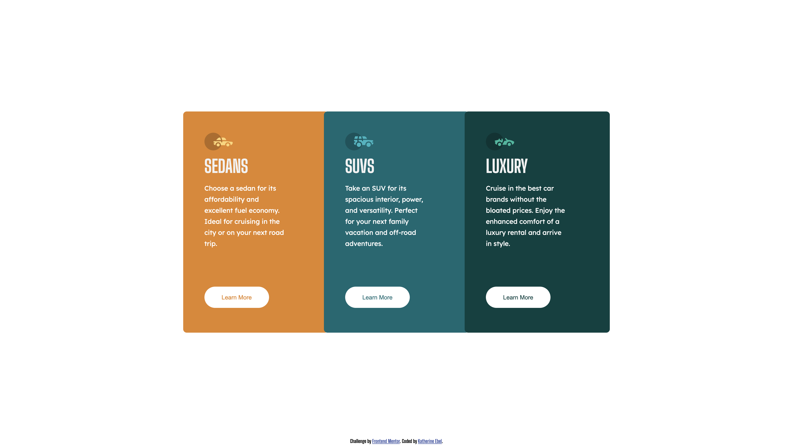

# Frontend Mentor - 3-column preview card component solution

This is a solution to the [3-column preview card component challenge on Frontend Mentor](https://www.frontendmentor.io/challenges/3column-preview-card-component-pH92eAR2-). Frontend Mentor challenges help you improve your coding skills by building realistic projects. 

## Table of contents

- [The challenge](#the-challenge)
- [Screenshot](#screenshot)
- [Links](#links)
- [Built with](#built-with)
- [Continued development](#continued-development)
- [Author](#author)  

### The challenge

Users should be able to:

- View the optimal layout depending on their device's screen size
- See hover states for interactive elements

### Screenshot

### Links

- Solution URL: [Github](https://github.com/KatherineEbel/fem-3-column-preview-card-component)
- Live Site URL: [Github Page](https://katherineebel.github.io/fem-3-column-preview-card-component/)

### Built with

- Semantic HTML5 markup
- CSS custom properties
- Flexbox
- CSS Grid
- Mobile-first workflow

### Continued development

I wasn't sure how the layout should be rendered on tablet-sized devices.  
Might need to make some modification at those viewport sizes.

## Author

- Website - [Katherine Ebel](https://www.your-site.com)
- Frontend Mentor - [@KatherineEbel](https://www.frontendmentor.io/profile/KatherineEbel)
- Twitter - [@Kathy_Ebel](https://www.twitter.com/Kathy_Ebel)
